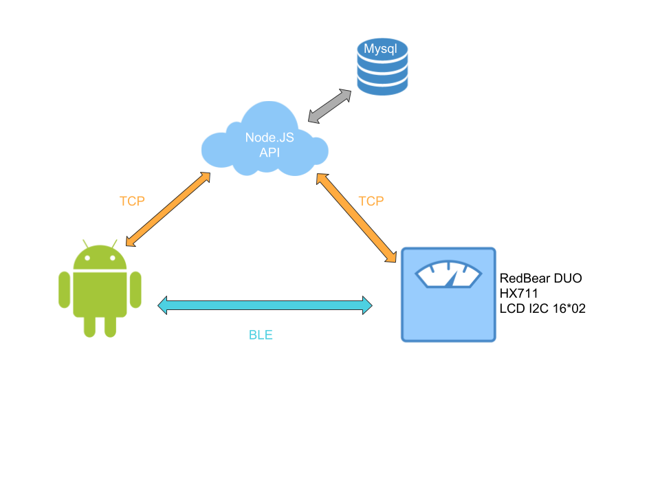
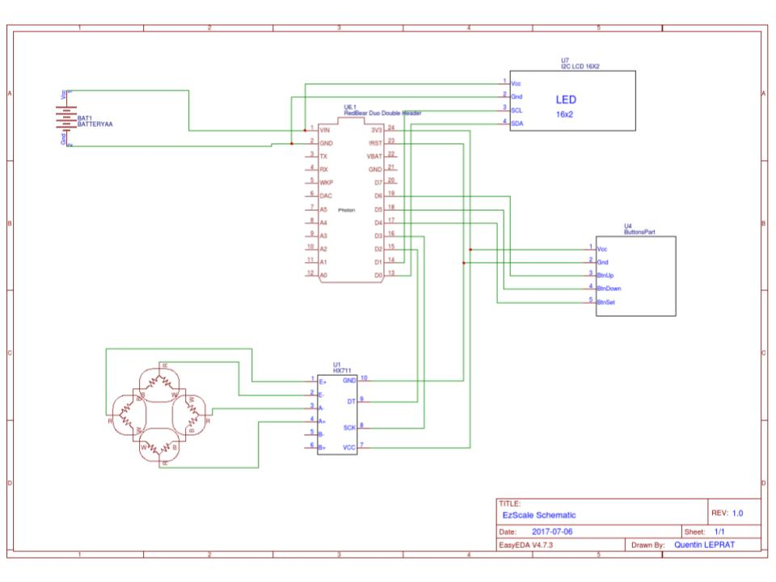

# EzScale Arduino

**EzScake** is a project made in ESGI school cursus. Our mission was to build a project by using a iot object, mobile application and API service. We choici to build a weigh scale.

### Work with
* [Node.Js Api](https://github.com/CrabeMan/EzScale-Api)
* [Android Application](https://github.com/CrabeMan/EzScale-Android)

## Built With
* [Default Scale Body](https://www.amazon.fr/gp/product/B015PLKK62/ref=oh_aui_detailpage_o06_s00?ie=UTF8&psc=1)
* [RedBear Duo](https://redbear.cc/product/wifi-ble/redbear-duo.html)
* [I2C Screen 16*2](https://www.amazon.fr/gp/product/B019SXNKGU/ref=oh_aui_detailpage_o01_s00?ie=UTF8&psc=1)
* [HX711](#)

## How to work ?
We use the RedBear duo board. We use the BLE to communicate with the Android application to setup the wifi connection and link the user's account to the weigh scale. The Wifi is use to send the weighing to the API.

### HX711
We use a HX711 for amplify and calibrate the weight sensors. These 4 weighing pressure sensor, present on the original weigh scale, hooked up in a wheatstone bridge formation.

### LCD Screen
We replace the original LCD screen for a 16*2 LCD I2C screen.

### Front Buttons
The default body scale was equipped of three buttons and a LCD screen. We has use these three buttons for the profil selection and the confirmation when weighing.

### BLE GATT
We create a GATT service to communicate with the Android application. The service has for address: 713d0000-503e-4c75-ba94-3148f18d941e. This service contain two custom characteristic

| Address                              | Type          | Byte Length  | Info      |
| ------------------------------------ |:-------------:| ------------:|----------:|
| 713d0002-503e-4c75-ba94-3148f18d941e | Read   Notify | 2            | 1 Byte Scale Status   1 Byte Wifi Status |
| 713d0001-503e-4c75-ba94-3148f18d941e | Write  Notify | 20           | Json Gate |

##### Scale Status
| State | Byte |
| ----- | ----:|
| INIT  | 0x00 |
| READY | 0x01 |

##### Wifi Status
| State                   | Byte | State           | Byte |
| ----------------------- | ----:| --------------- |-----:|
| INIT                    | 0x00 | CONNECTED       | 0x04 |
| NO_CREDENTIAL           | 0x01 | CONNECT_TIMEOUT | 0x10 |
| CONNECTING              | 0x02 | DHCP_TIMEOUT    | 0x11 |
| CONNECTED_WAIT_FOR_DHCP | 0x03 | SCANNING        | 0x15 |

##### Json Gate
We use a custom characteristic as a gateway to communicate with batch of 20 bytes of Json message. The application can write to this characteristic to send json batch and subscribe to be notify of incoming json batch.

| Separator | Byte |
| --------- | ----:|
| Start     | 0x02 |
| End       | 0x03 |

## Authors
* **Quentin LEPRAT** - [CrabeMan](https://github.com/CrabeMan)
* **Rémi OLLIVIER** - [LAcrym0](https://github.com/LAcrym0)

## License

This project is licensed under the MIT License - see the [LICENSE.md](LICENSE.md) file for details
